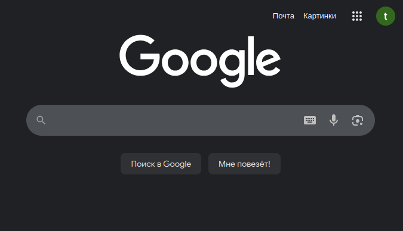
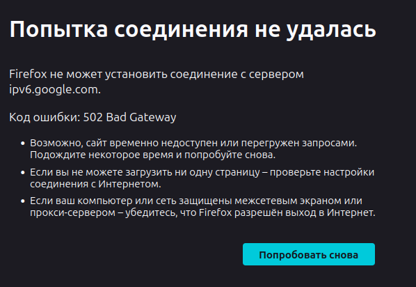

Сервер на **100%** поддерживает новый протокол - **IPv6**, и его использование предпочтительно - это **уменьшает пинг** и делает игру комфортнее!

Как проверить что у вас есть IPv6?
1. Перейдите на сайт: [**ipv6.google.com**](https://ipv6.google.com/)
2. Дождитесь загрузки...

3. Всё работает? Вы 100% имеете **IPv6**. Таким образом, вам стоит использовать наш V6 адрес: `v6.trassert.ru` вместо `trassert.ru`

Если же сайт недоступен, 

то вам стоит уточнить поддержку **IPv6** вашим провайдером, или выставить корректные настройки в роутере/модеме.